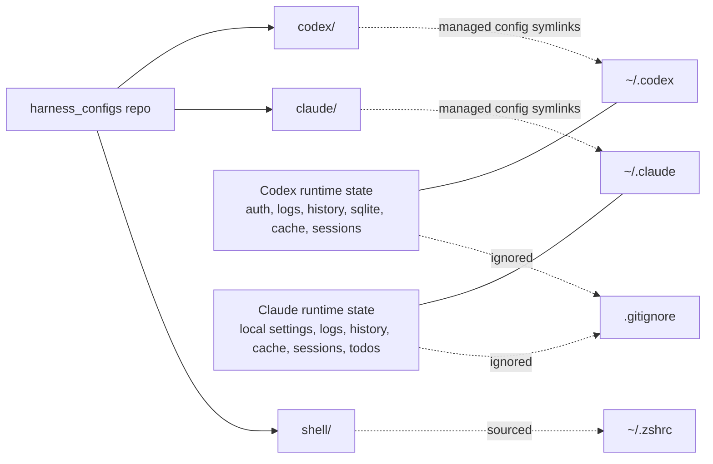
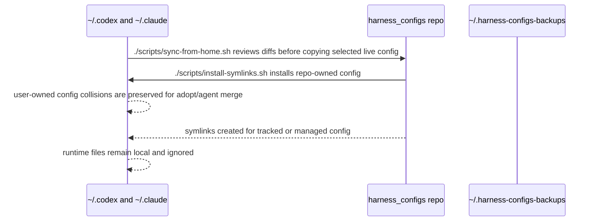

# How It Works

## Relationship

## Symlink Map

Most files are symlinked directly from the repo into the tool home directory. Root config files are conditional: `~/.claude/settings.json` and `~/.codex/config.toml` may be user-owned, so the installer asks before replacing them.

Codex (`~/.codex/` ← `codex/`):

- `AGENTS.md`
- `config.toml` when managed
- `hooks.json`
- `MANAGED_BY_HARNESS_CONFIGS.md`
- `rules/`
- `skills/`

Claude (`~/.claude/` ← `claude/`):

- `CLAUDE.md`
- `settings.json` when managed
- `MANAGED_BY_HARNESS_CONFIGS.md`
- `commands/`
- `hooks/`
- `skills/`

## Sync Flow

