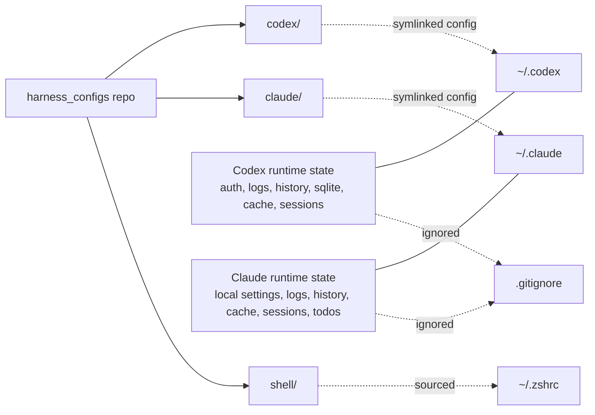
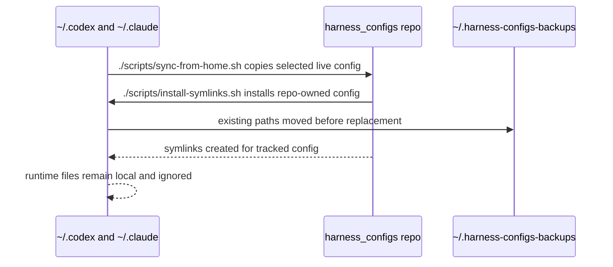

# How It Works

## Relationship

## Symlink Map

Codex (`~/.codex/` ← `codex/`):

- `AGENTS.md`
- `config.toml`
- `hooks.json`
- `MANAGED_BY_HARNESS_CONFIGS.md`
- `rules/`
- `skills/`

Claude (`~/.claude/` ← `claude/`):

- `CLAUDE.md`
- `settings.json`
- `MANAGED_BY_HARNESS_CONFIGS.md`
- `commands/`
- `hooks/`
- `skills/`

## Sync Flow

