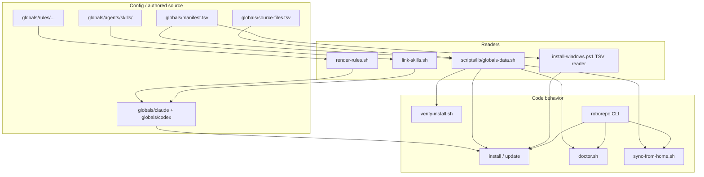
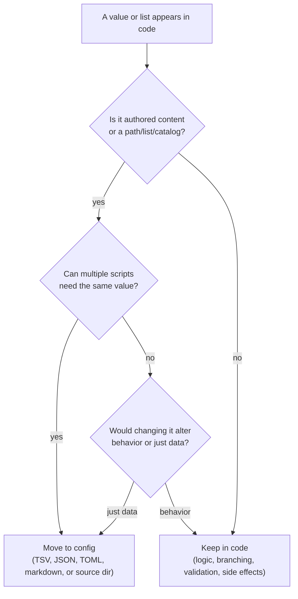
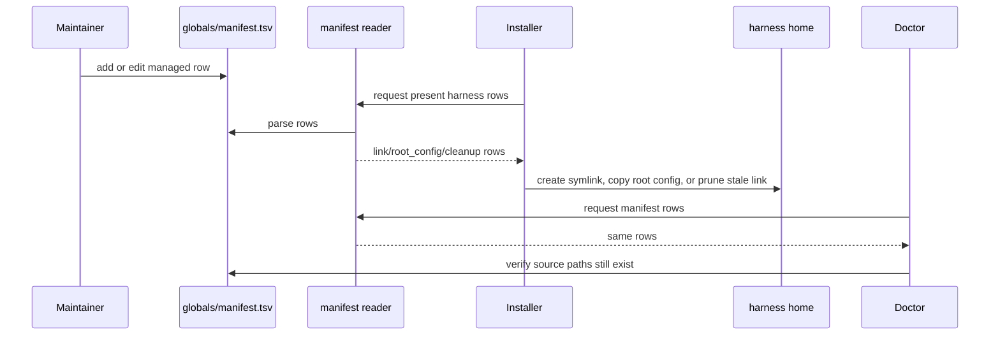

# Config-Code Separation

This repo keeps dynamic values and authored content in data files, while scripts keep the
behavior: parsing, validation, prompting, linking, copying, pruning, and reporting.

## Definition List

| Term | Definition |
| --- | --- |
| **config** | Lists, mappings, authored content, baseline files, flags, and defaults that can change without changing behavior. |
| **code** | Logic that interprets config: branching, validation, prompting, filesystem mutation, command dispatch, and error handling. |
| **manifest** | `globals/manifest.tsv`, the managed home-path inventory. It says what roborepo manages and how each row behaves. |
| **reader** | A small parser that turns config files into script-friendly rows or objects. Bash uses `scripts/lib/globals-data.sh`; PowerShell parses the manifest in `install-windows.ps1`. |
| **consumer** | A script that reads config and performs behavior, such as install, verify, doctor, or sync. |
| **authored source** | Human-maintained repo content under `globals/`, such as rules, skills, hooks, commands, and baseline harness config. |
| **generated output** | Files rendered from authored source, such as `globals/claude/CLAUDE.md` and `globals/codex/AGENTS.md`. |

## Current Boundary

| Area | Config or source of truth | Code that interprets it |
| --- | --- | --- |
| Managed home paths | `globals/manifest.tsv` | `install/main.sh`, `install-claude.sh`, `install-codex.sh`, `install-windows.ps1`, `verify-install.sh`, `doctor.sh`, `sync-from-home.sh` |
| Required repo files | `globals/source-files.tsv` | `doctor.sh` |
| Agent rules | `globals/rules/{shared,claude,codex}/` | `scripts/build/render-rules.sh` |
| Global harness config | `globals/claude/`, `globals/codex/`, `globals/agents/` | Installers, verify, doctor, write guard |
| Shared skills | `globals/agents/skills/` | `scripts/build/link-skills.sh`, `roborepo skill export` |
| Repo-local skills | `local/skills/` | `scripts/build/link-skills.sh`, doctor checks |
| CLI implementation | command modules under `scripts/cli/` | `scripts/cli/main.mjs` dispatch |

## Relationship Diagram

## Decision Boundary

Use this rule when deciding whether a value belongs in config or code.

## Manifest Workflow

## Row Kind Table

| Manifest kind | Config says | Code does | Reverse sync |
| --- | --- | --- | --- |
| `link` | Home path should point at repo source. | Preflight conflicts, create symlink, verify target. | Syncs home back to repo unless `nosync`. |
| `root_config` | Home path starts from repo baseline but becomes user-owned. | Copy file, adopt on collision, verify active local file. | Skips unless `--include-root-config`. |
| `cleanup` | Old managed path should no longer be linked to repo. | Remove old repo symlink only. | Never synced. |

## Remaining Candidates

| Candidate | Current location | Possible config file | Why it may help | Keep in code |
| --- | --- | --- | --- | --- |
| MCP presets | `scripts/cli/mcp.mjs` | `globals/mcp-presets.json` | Moves `jcodemunch`/`jdocmunch` aliases, packages, and command args out of CLI logic. | URL detection, slugging, TOML writes, Claude command execution. |
| CLI menu/usage catalog | `scripts/cli/main.mjs` | `globals/cli-commands.json` | Menu labels, descriptions, aliases, and help text are data-like. | Dispatch, argument parsing, exit behavior. |
| Verify content assertions | `scripts/verify-install.sh` | `globals/verify-content.tsv` | Content checks like MCP block, hook text, and verification receipt could be centrally listed. | Regex execution, parse checks, link checks, summary output. |
| Harness metadata | install scripts | `globals/harnesses.tsv` | Presence roots and home roots could be listed alongside harness names. | OS-specific path resolution and install flow. |
| Prompt text | install/sync scripts | `globals/prompts/*.md` | Merge prompt wording could stop drifting between scripts. | Prompt timing, choices, and effects. |

## What Should Stay Code

| Behavior | Why |
| --- | --- |
| Collision handling | It is operational logic with side effects and user choices. |
| Dry-run handling | It changes execution flow, not just values. |
| Symlink creation and cleanup | OS/filesystem behavior belongs in script logic. |
| Interactive prompt loops | They control terminal state and stdin, especially sync's FD-3 manifest loop. |
| Validation and parse checks | They turn config into pass/fail behavior. |
| CLI dispatch | It decides which module runs and how exit codes propagate. |

## Related

- `docs/architecture/manifest-and-symlinks.md`
- `docs/plans/sync-from-home-manifest.md`
