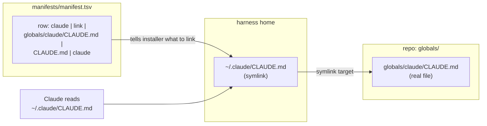
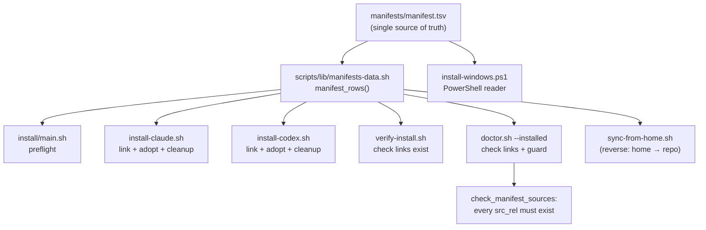
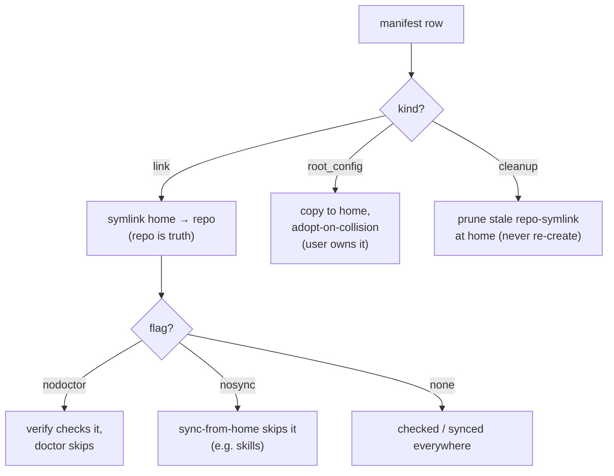
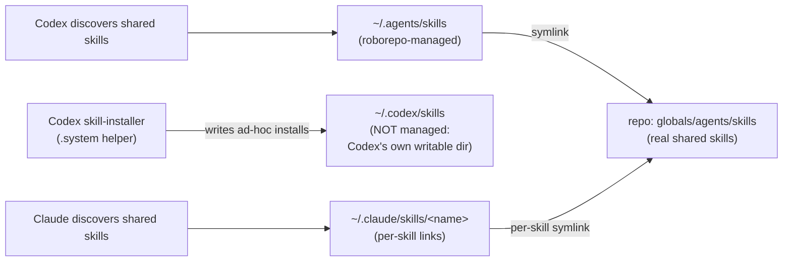

# Manifest & Symlink Model

How roborepo gets its version-controlled config from the repo into a user's harness homes
(`~/.claude`, `~/.codex`, `~/.agents`), and how every script agrees on what is managed.

## The one-sentence version

The repo holds the real files under `globals/`; the install scripts create **symlinks** in
your home harness dirs that point back at them; and a single data file —
`manifests/manifest.tsv` — is the **one list** every script reads to know what to link, verify,
or clean up.

## Glossary

Grouped by the kind of thing each term names.

### Places (where config lives)

| Term | Meaning |
| --- | --- |
| **harness** | An agent runtime that reads config from a home dir. Here: **Claude** (`~/.claude`) and **Codex** (`~/.codex` + `~/.agents`). |
| **globals/** | Repo dir holding the real, version-controlled config meant to go global. Subdirs: `claude/`, `codex/`, `agents/`, `rules/`. |
| **harness home** | The per-harness config dir in `$HOME`: `~/.claude`, `~/.codex`, `~/.agents`. |

### Data files (the lists, and who reads them)

| Term | Meaning |
| --- | --- |
| **manifest** | `manifests/manifest.tsv` — the single list of managed home↔repo paths. An inventory: *these things are managed, and how.* |
| **source-files list** | `manifests/source-files.tsv` — separate checklist of repo files that must exist (asserted by doctor). Tracks repo health, not home symlinks. |
| **Bash reader** | `scripts/lib/manifests-data.sh` — bash funcs (`manifest_rows`, `source_files`) that parse the data files so POSIX scripts do not hardcode the list. |
| **PowerShell reader** | `scripts/install/install-windows.ps1` — parses `manifests/manifest.tsv` directly for Windows installs. |
| **consumer** | A script that reads the manifest: `main.sh`, `install-claude.sh`, `install-codex.sh`, `install-windows.ps1`, `verify-install.sh`, `doctor.sh`, `sync-from-home.sh`. |

### Manifest row vocabulary (what a row says)

| Term | Meaning |
| --- | --- |
| **row kind** | What a row *does*: `link`, `root_config`, or `cleanup`. |
| **`link`** | Clean symlink: `~/.harness/` → `repo/globals/...`. Repo is source of truth. |
| **`root_config`** | Mutable user state (`settings.json`, `config.toml`). **Copied**, not linked; left in place on collision ("adopt"). User owns it. |
| **`cleanup`** | A path roborepo *used* to manage. Install **prunes** the old repo-symlink there; never re-created. `src_rel` is `-`. |
| **flag `nodoctor`** | Row is checked by `verify-install.sh` but intentionally **not** by `doctor --installed`. |
| **flag `nosync`** | Row is skipped by `sync-from-home.sh` (e.g. skills — maintained in-repo and symlinked outward, never pulled back). |

### Behaviors (verbs the installer performs)

| Term | Meaning |
| --- | --- |
| **adopt** | "Keep the local file, don't overwrite." Triggered on a `root_config` collision, or pre-declared via `HARNESS_ADOPT_<HARNESS>_CONFIG=1` for unattended runs. |
| **prune** | Remove a retired repo-symlink from a home path (the action a `cleanup` row drives), backing it up first. |

## How a managed file flows from repo to home

The example below uses one Claude file (`CLAUDE.md`), but the flow is identical for **every
`link` row of every harness** — `~/.codex/AGENTS.md`, `~/.agents/skills`, etc. all work the
same way: real file in `globals/`, symlink in the home dir, agent reads the symlink.

The agent reads its home dir; the home dir is a symlink; the symlink resolves to the real
repo file. Edit the repo file → every harness sees the change with no re-copy.

## One manifest, many consumers

Before this model, the same home↔repo list was hand-copied across 7+ scripts. Change one,
forget another, and they drift. Now they all read one file:

`check_manifest_sources` (in doctor) is the **drift guard**: if a row names a repo file that
was renamed or deleted, doctor fails loudly instead of the installer silently skipping it.

The PowerShell installer does not source the bash reader. It parses the same TSV file itself,
then applies the same row kinds: `link`, `root_config`, and `cleanup`. That keeps Windows off
the old hand-copied path list without making PowerShell depend on a POSIX shell.

## Row kind → behavior

## The skills layout

roborepo manages Codex's shared skills at `~/.agents/skills` (the modern open "Agent Skills"
path). It does **not** manage `~/.codex/skills` — that legacy path is left to Codex's own
tooling (see below).

### Why `~/.codex/skills` is not managed (legacy-decoupling)

OpenAI is mid-migration and is internally inconsistent about the skills path:

- The **modern standard** is `~/.agents/skills` (open "Agent Skills"). roborepo targets this,
  and Codex discovers shared skills there.
- But Codex's **own bundled `.system` helper** `skill-installer` still hardcodes the **legacy**
  `$CODEX_HOME/skills` (= `~/.codex/skills`): `list-skills.py` reads it, and
  `install-skill-from-github.py` writes downloaded skills into it. That helper has not caught
  up to the new path.

These two tools do different jobs and are complementary:

| roborepo (this repo) | Codex `skill-installer` (.system helper) |
| --- | --- |
| Curated, version-controlled, shared-across-machines skill set | Ad-hoc, per-user, fetched on demand |
| Serves only what is committed to `globals/agents/skills/` | Downloads arbitrary skills from `openai/skills` or any GitHub repo |
| Targets the modern `~/.agents/skills` | Writes to the legacy `~/.codex/skills` |

**The bug we removed:** the installer used to symlink `~/.codex/skills` → the repo's
read-only `globals/agents/skills`. If the native helper ever ran, its downloaded skills would
land **inside the version-controlled repo**, mixing personal installs into the shared set.

**Resolution (implemented):** roborepo commits to the modern path and fully decouples from the
legacy one.
- `~/.agents/skills` → repo shared skills (managed `link`).
- `~/.codex/skills` → left as a plain local dir Codex's helper owns; any old repo-symlink
  there is pruned via a `cleanup` row so installs never reach the repo.

When OpenAI updates `skill-installer` to the `.agents/skills` standard, the two converge with
no change needed here.

> Note on "exclusively": prior code comments claimed Codex scans `~/.agents/skills`
> *exclusively*. That came from in-repo comments, not verified Codex docs. The decoupling above
> does not depend on it — even if Codex also reads `~/.codex/skills`, keeping it unmanaged is
> correct, because that dir is exactly where the native helper expects to own its installs.

## Related

- `docs/architecture/config-code-separation.md` — simple breakdown of what belongs in
  config versus code, plus remaining extraction candidates.
- `docs/plans/sync-from-home-manifest.md` — history of the `sync-from-home.sh` manifest
  migration (now done), the `blocklist.json` decision it resolved, and the FD-3 interactive
  prompt gotcha.
- `docs/reference/services/architecture.md` — broader repo/install architecture.
