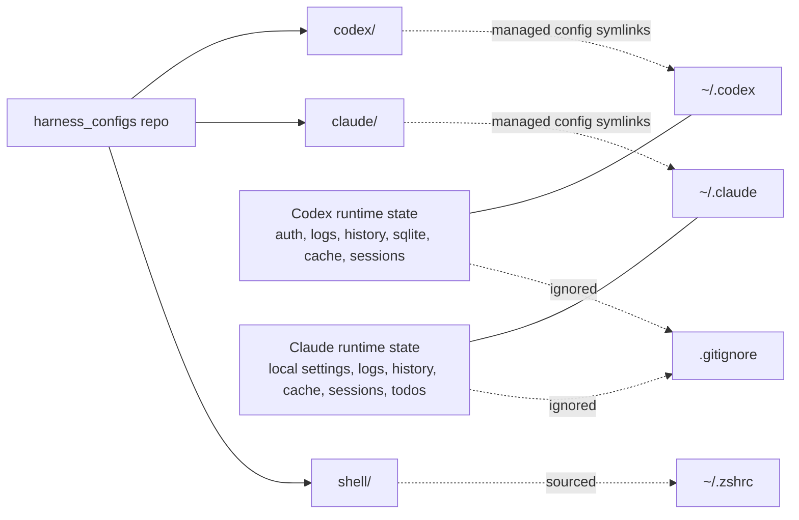
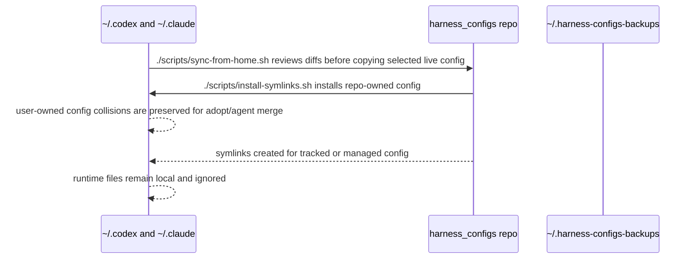

# How It Works

## Relationship

## Symlink Map

Most files are symlinked directly from the repo into the tool home directory. Root config files are conditional: `~/.claude/settings.json` and `~/.codex/config.toml` may be user-owned, so the installer asks before replacing them.

Codex (`~/.codex/` ← `codex/`):

- `AGENTS.md`
- `config.toml` when managed
- `hooks.json`
- `MANAGED_BY_HARNESS_CONFIGS.md`
- `rules/`
- `skills/`

Claude (`~/.claude/` ← `claude/`):

- `CLAUDE.md`
- `settings.json` when managed
- `MANAGED_BY_HARNESS_CONFIGS.md`
- `commands/`
- `hooks/`
- `skills/`

### Shared skills use two symlink levels

`skills/` above is not a passthrough — it is a two-level structure:

1. **Home → repo (install-time).** `~/.claude/skills` and `~/.codex/skills` are
   symlinks to the real directories `claude/skills/` and `codex/skills/`. Created once
   by `install-symlinks.sh`.
2. **Per-harness → shared source (in-repo).** Each shared skill's content lives once in
   `skills/<name>/`. Inside `claude/skills/` and `codex/skills/`, each skill is an
   individual symlink `<name> -> ../../skills/<name>`.

Per-skill symlinks (rather than one folder symlink to `skills/`) let each harness share
the common skills while keeping its own — for example Codex's `codex/skills/.system/`
skills, which are real files that exist only on that side.

A skill's source folder alone is therefore not enough; without the per-harness symlinks
the harnesses do not see it. `scripts/link-skills.sh` derives the per-skill symlinks from
`skills/` — it creates any missing links and prunes orphaned ones (symlinks whose source
is gone), and is idempotent. `scripts/doctor.sh` verifies the same set, also derived from
`skills/`, so neither needs editing when a skill is added or removed.

### Two skill layers: shared vs. internal

There are two distinct, firewalled skill layers:

- **Shared** — `skills/<name>/`, linked into `claude/skills` + `codex/skills` (and thus into
  global `~/.claude`/`~/.codex`), and exportable to other repos. Advisory coding skills any repo
  may receive.
- **Internal** — `skills-local/<name>/`, linked **only** into this repo's own project-scope
  dotdirs (`.claude/skills`, `.codex/skills`) by a second pass of `link-skills.sh`. These describe
  how to develop/maintain this repo and are **never** global and **never** exported. The
  separation is structural: the export/installer tools read only `skills/`, with no code path to
  `skills-local/`.

### Client utilities (same model, for other repos)

Two Node commands give other repos the same dual-harness skill model:
`harness_helper --export-skill` (bundle shared skills into a `.zip` + copy into a target repo) and
`harness-install-local-skills` (symlink a client repo's own `.claude/skills` into the installed
global harnesses). Both share `scripts/skill-lib.mjs`; canonical client dirs are `.claude/skills`
+ `.codex/skills`.

## Sync Flow

