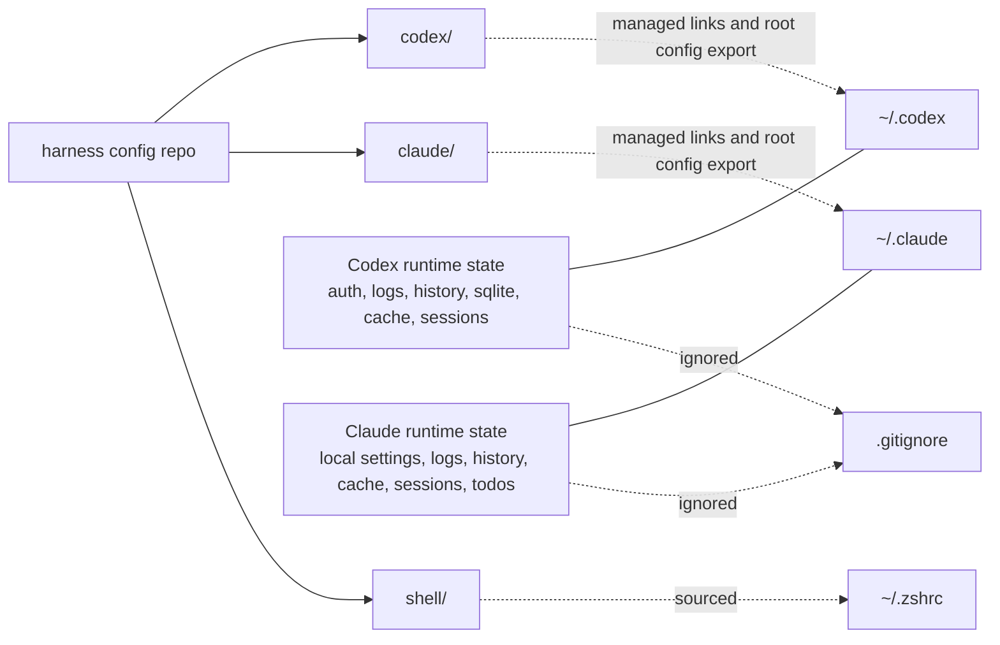

# How It Works

## Relationship



## Symlink Map

Most files are symlinked directly from the repo into the tool home directory. Root config files are different: `~/.claude/settings.json` and `~/.codex/config.toml` are mutable active files, so the installer copies repo baselines when missing or identical and asks before merging existing local content.

Codex (`~/.codex/` ← `codex/`, plus skills under `~/.agents/` ← `agents/`):

- `AGENTS.md`
- `config.toml` exported as a local active file
- `hooks.json`
- `MANAGED_BY_ROBOREPO.md`
- `rules/`
- `skills/` — Codex scans `~/.agents/skills` **exclusively** (there is no `~/.codex/skills`
  fallback), so the canonical link is `~/.agents/skills → agents/skills`. `~/.codex/skills`
  is kept as a transitional cross-compat link to the same source.

Claude (`~/.claude/` ← `claude/`):

- `CLAUDE.md`
- `settings.json` exported as a local active file
- `MANAGED_BY_ROBOREPO.md`
- `commands/`
- `hooks/`
- `skills/`

## Install Workflow Filesystem Shapes

Root config files are mutable user state. The repo keeps portable baseline templates, but active home files are local copies or user-owned files, not direct symlinks.

### Managed Read-Mostly Assets

Repo files are the source of truth for read-mostly assets. The global harness path observes them through symlinks.

```text
~/.codex/AGENTS.md      -> <repo>/codex/AGENTS.md
~/.codex/hooks.json     -> <repo>/codex/hooks.json
~/.codex/rules          -> <repo>/codex/rules
~/.agents/skills        -> <repo>/agents/skills
~/.claude/CLAUDE.md     -> <repo>/claude/CLAUDE.md
~/.claude/hooks         -> <repo>/claude/hooks
~/.claude/skills        -> <repo>/claude/skills
```

Implication: updates in this repo become active globally for these assets. User edits at the global path edit the repo file through the symlink.

### Root Config Export

Repo files are portable baselines. Active global files are local copies or existing user-owned files.

```text
<repo>/codex/config.toml                # repo baseline
~/.codex/config.toml                    # active local file

<repo>/claude/settings.json             # repo baseline
~/.claude/settings.json                 # active local file
```

Implication: runtime trust, hook approvals, local profiles, and machine-specific state stay out of repo source. If both sides exist, the installer keeps the local file and prints merge guidance instead of replacing it.

### Root Config Merge Options

#### Replace existing files

Repo version becomes active in the global config location. Existing local files are preserved in an archive folder.

```text
~/.codex/
  config.toml                    # copied/adopted repo version, active
  archived/
    config_archived_<timestamp>.toml

~/.claude/
  settings.json                  # copied/adopted repo version, active
  archived/
    settings_archived_<timestamp>.json
```

Implication: user does not lose old config, but must merge wanted local settings back from `archived/`.

#### Keep existing files

User-owned config remains active. Repo candidates are preserved in a staging folder for later merge.

```text
~/.codex/
  config.toml                    # existing local version, active
  not_adopted/
    config_repo_<timestamp>.toml

~/.claude/
  settings.json                  # existing local version, active
  not_adopted/
    settings_repo_<timestamp>.json
```

Implication: user keeps current behavior, but must merge wanted repo defaults from `not_adopted/`.

#### Agent prompt

User-owned config remains active. The installer prints an agent prompt that points at both local and repo paths.

```text
<repo>/codex/config.toml                # repo candidate
~/.codex/config.toml                    # existing local version, active

<repo>/claude/settings.json             # repo candidate
~/.claude/settings.json                 # existing local version, active
```

Implication: no automatic merge. The agent/user compares both sides and applies intentional edits.

### Future layered model

Desired but not implemented:

```text
repo baseline
        ↓ inherited by
user global config overlay
        ↓ refined by
local repo context
```

This needs either native harness include support or a generated/merged config pipeline. Track this in [../../plans/harness-parity-todo.md](../../plans/harness-parity-todo.md).

### Shared skills: canonical source + per-harness fan-out

The canonical shared source is `agents/skills/<name>/` (each a folder with a `SKILL.md`).
The two harnesses reach it differently because Codex and Claude scan different paths:

- **Codex** scans `~/.agents/skills` exclusively. So `install/main.sh` links
  `~/.agents/skills → agents/skills` directly (plus a transitional `~/.codex/skills →
  agents/skills` for cross-compat). Codex needs **no** per-skill intermediate dir, and there
  is no longer a `codex/skills/` directory in the repo. Codex's own `.system/` skills
  (imagegen, openai-docs, skill-creator, …) are real files living at `agents/skills/.system/`,
  so they ride into `~/.agents/skills/.system` automatically.
- **Claude** scans `~/.claude/skills`. That is a folder symlink to the repo's `claude/skills/`,
  inside which each shared skill is an individual symlink `<name> -> ../../agents/skills/<name>`.
  The per-skill layer lets Claude carry the shared skills alongside any Claude-only ones.

A skill's source folder alone is therefore not enough for Claude; without the per-skill
symlinks Claude does not see it. `scripts/link-skills.sh` derives the Claude per-skill symlinks
from `agents/skills/` — it creates any missing links and prunes orphaned ones (symlinks whose
source is gone), and is idempotent. `scripts/doctor.sh` verifies the same set, also derived
from `agents/skills/`, so neither needs editing when a skill is added or removed.

### Two skill layers: shared vs. internal

There are two distinct, firewalled skill layers:

- **Shared** — `agents/skills/<name>/`, the canonical source. Linked into `claude/skills` (for
  Claude) and reached by Codex via `~/.agents/skills`; thus global on both harnesses, and
  exportable to other repos. Advisory coding skills any repo may receive.
- **Internal** — `skills-local/<name>/`, linked **only** into this repo's own project-scope
  dotdirs (`.claude/skills`, `.agents/skills`) by a second pass of
  `link-skills.sh`. These describe how to develop/maintain this repo and are **never** global and
  **never** exported. The separation is structural: the export/installer tools read only
  `agents/skills/`, with no code path to `skills-local/`.

### Client utilities (same model, for other repos)

One Node command, `roborepo`, is the consumer front door (see the README for the full subcommand
list). For the dual-harness skill model it offers:

- `skill export`: bundles shared skills into a `.zip` and copies them into a target repo's
  `.agents/skills` plus harness-specific skill folders.
- `skill install`: treats the target repo's own `.agents/skills/<name>` as the canonical project
  skill source, then symlinks those skills into selected `.claude/skills` and/or `.codex/skills`
  folders. Existing `.claude` and `.codex` roots are used automatically; when run interactively and
  a root is missing, it asks whether to create/link that target. Noninteractive runs do not create
  new agent roots. `skill link` is a compatibility alias.

This is purely in-repo and never touches global `~/.claude`, `~/.codex`, or `~/.agents`.
`.agents/skills` is canonical because Codex scans that path directly; Claude and the transitional
Codex path are fan-out links from that source.

`roborepo` also folds in `mcp add`/`index`/`watch`/`run` and dispatches the lifecycle verbs
`update`/`sync`/`doctor`/`verify` to the existing bash scripts (the first install is the shell
bootstrap `install/main.sh`, so there is no root-level `install` verb). Shared skill logic lives
in `scripts/cli/skill-lib.mjs`.

## Sync Flow

```mermaid
sequenceDiagram
  participant Home as ~/.codex and ~/.claude
  participant Repo as harness config repo
  participant Backup as ~/.roborepo-backups

  Home->>Repo: ./scripts/sync-from-home.sh reviews diffs before copying selected live config
  Repo->>Home: ./scripts/install/main.sh installs repo-owned config
  Home-->>Home: user-owned config collisions are preserved for adopt/agent merge
  Repo-->>Home: symlinks for read-mostly assets; local copies for root config
  Home-->>Home: runtime files remain local and ignored
```
