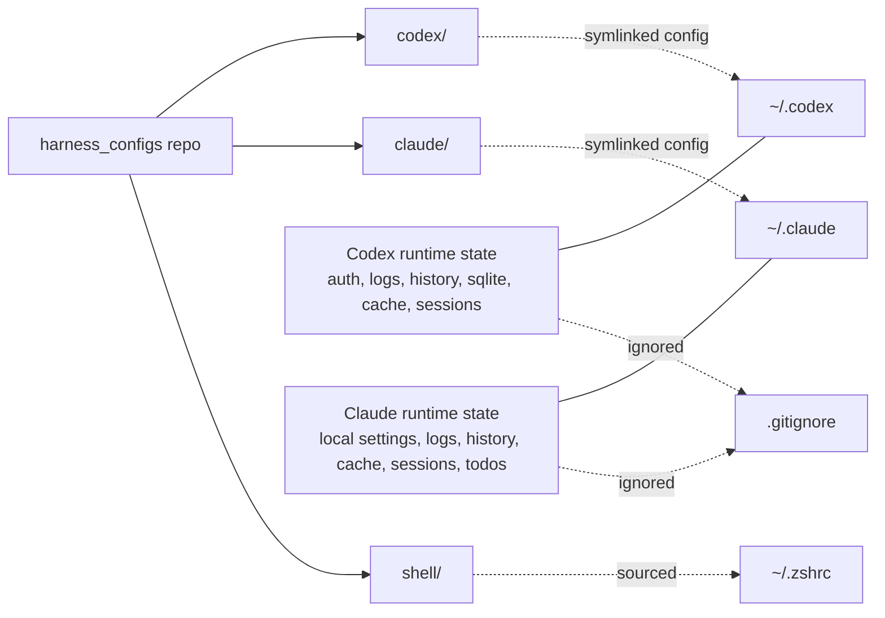
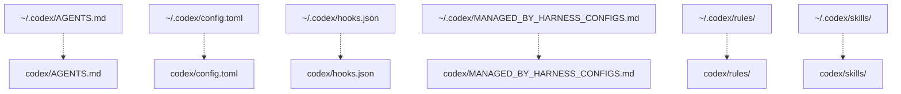
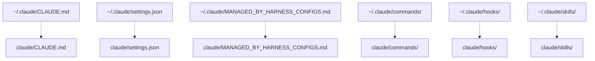
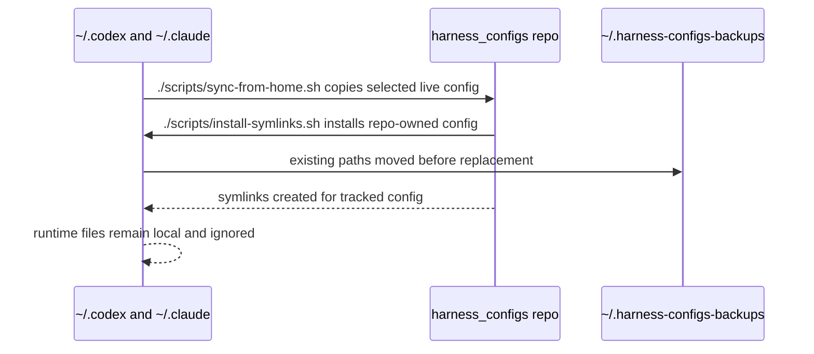

# Setup

This repo owns stable harness config and exposes it at the paths agents already read:

- `~/.codex`
- `~/.claude`

Runtime state, auth, logs, caches, histories, sessions, SQLite DBs, local settings, and generated plugin caches stay outside git.

## Platform Support

| Platform | Status | Notes |
|----------|--------|-------|
| macOS | Primary | Fully supported and tested |
| Linux | Supported | Same scripts as macOS; see [Linux notes](#linux) |
| Windows | Available | Less tested; requires Git for Windows for hooks — see [Windows notes](#windows) |

## Harness Support

Install scripts detect which harnesses are present and skip any that aren't installed. You can use this repo with:

- **Claude Code only** — only `~/.claude` is symlinked
- **Codex only** — only `~/.codex` is symlinked
- **Both** — both are symlinked

To add a harness later: install it, then re-run `./scripts/install-symlinks.sh`.

## Relationship



## Symlink Map

Codex:



Claude:



## Sync Flow



## Commands

### Set up a new device

Run this after cloning the repo on a new machine:

```sh
./scripts/install-symlinks.sh
```

This detects which harnesses are installed, symlinks their config from this repo, installs global commands, and adds shell snippets to your profile.

Existing live files/dirs are moved to `~/.harness-configs-backups/<timestamp>/` before symlinks are created.

Preview changes without modifying anything:

```sh
./scripts/install-symlinks.sh --dry-run
```

Verify the install:

```sh
./scripts/verify-install.sh
```

### Install a single harness

Run these directly if you only want to (re)link one harness:

```sh
./scripts/install-claude.sh
./scripts/install-codex.sh
```

Both support `--dry-run`.

### Capture live config changes

Use this when config was changed directly in `~/.codex` or `~/.claude` and should be copied back into the repo:

```sh
./scripts/sync-from-home.sh
```

This only copies selected stable config. Runtime files remain ignored.

### Reinstall agent symlinks

The script is idempotent — re-running it is safe:

```sh
./scripts/install-symlinks.sh
```

### Install shell snippets

```sh
./scripts/install-shell-snippets.sh
```

Adds source lines for `shell/jcodemunch.zsh` and `shell/jdocmunch.zsh` to `~/.zshrc`.

### Install global commands

```sh
./scripts/install-global-commands.sh
```

Symlinks `jcmwatch`, `jcmindex`, `jdmindex`, and `harness-run` into `~/.local/bin`. Updates the active POSIX shell profile:

- zsh: `~/.zshrc`
- bash: `~/.bashrc` or `~/.bash_profile`
- fallback: `~/.profile`

Override the target profile with:

```sh
HARNESS_CONFIG_SHELL_PROFILE=~/.profile ./scripts/install-global-commands.sh
```

### jcmwatch

`jcmwatch` watches a repo and keeps the jcodemunch index current:

```sh
jcmwatch              # watch $PWD
jcmwatch path/to/dir
```

---

## Linux

Same scripts as macOS. The scripts handle the platform difference (`md5sum` vs `md5`) automatically.

No additional setup required.

---

## Windows

**Requirements:**
- **Git for Windows** (https://git-scm.com) — provides Git Bash, which runs the `.sh` install scripts and hook scripts at runtime. This is standard for Windows developers.
- **Windows Developer Mode** or **admin PowerShell** — required for creating symlinks (`Settings > System > For Developers > Developer Mode`)

**Install from Git Bash:**

```bash
./scripts/install-symlinks.sh
```

Git Bash is detected automatically. The script calls `install-windows.ps1` via `powershell.exe` to create symlinks, then continues with bash-specific steps.

**Install from PowerShell (symlinks only):**

```powershell
.\scripts\install-windows.ps1
```

Then open Git Bash and run:

```bash
./scripts/install-global-commands.sh
./scripts/install-shell-snippets.sh
```

**Windows limitations:**
- Hook scripts (`jcmwatch`, `jcmindex`, `jdmindex`) require Git Bash or WSL to run — they are bash scripts
- Claude Code on Windows uses Git Bash for shell commands when Git for Windows is installed
- Windows support is less tested — report issues or submit PRs

**Config paths on Windows:**

| Item | Path |
|------|------|
| Claude config | `%APPDATA%\Claude\` |
| Codex config | `%USERPROFILE%\.codex\` |
| Global commands | Add `bin/` to Windows `PATH` manually, or use Git Bash |
