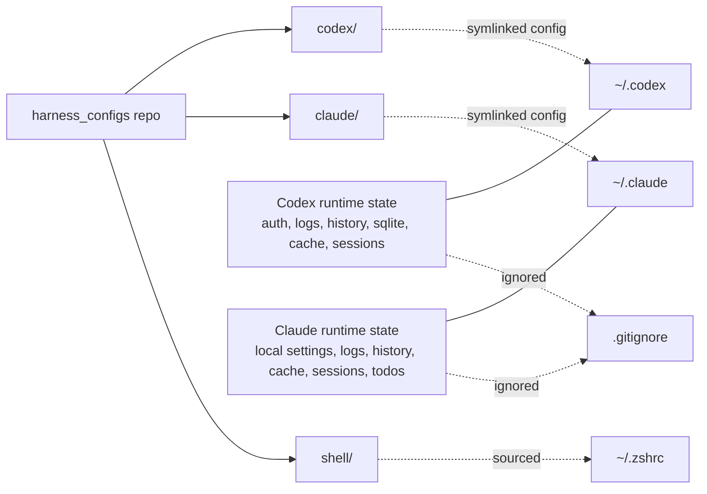
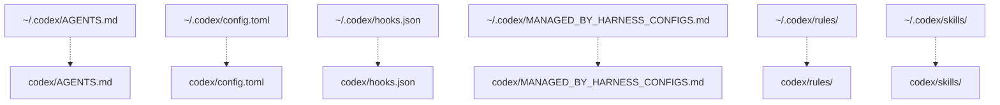
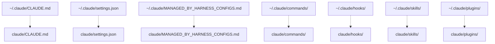
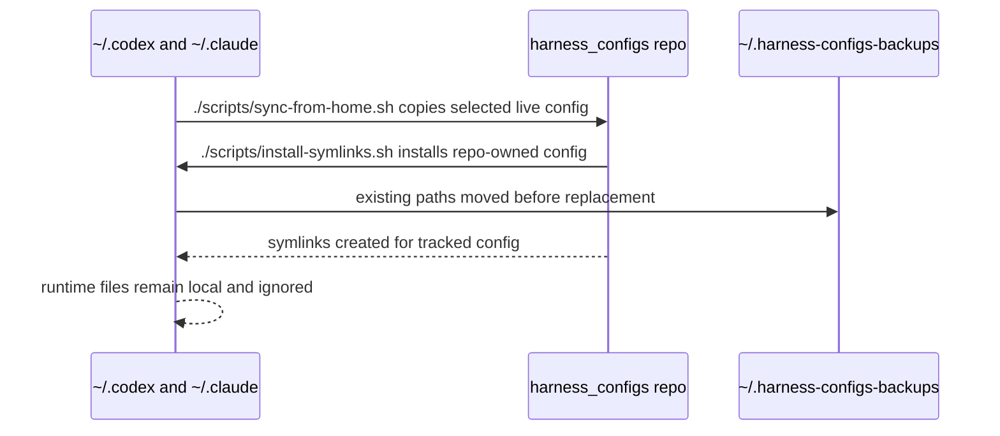

# Symlinking Model

This repo owns stable harness config and exposes it at the paths agents already read:

- `~/.codex`
- `~/.claude`

Runtime state, auth, logs, caches, histories, sessions, SQLite DBs, local settings, and generated plugin caches stay outside git.

## Relationship



## Symlink Map

Codex:



Claude:



## Sync Flow



## Commands

### Set up a new device

Run this after cloning the repo on a new machine:

```sh
./scripts/install-symlinks.sh
./scripts/install-global-commands.sh
```

`install-symlinks.sh` makes agents read config from this repo by replacing selected paths in `~/.codex` and `~/.claude` with symlinks.

`install-global-commands.sh` exposes repo commands like `jcmwatch` through `~/.local/bin`.

Existing live files/dirs are moved to `~/.harness-configs-backups/<timestamp>/` before symlinks are created.

Preview symlink changes without modifying home config:

```sh
./scripts/install-symlinks.sh --dry-run
```

Verify the install:

```sh
./scripts/verify-install.sh
```

### Capture live config changes

Use this when config was changed directly in `~/.codex` or `~/.claude` and should be copied back into the repo:

```sh
./scripts/sync-from-home.sh
```

This only copies selected stable config. Runtime files remain ignored.

### Reinstall agent symlinks

Use this if a tool replaced a symlink with a real file or if the home-directory config needs to be pointed back at the repo:

```sh
./scripts/install-symlinks.sh
```

The script is idempotent for symlinks that already point to this repo.

### Install shell snippets

Use this if you want shell functions sourced directly from the repo:

```sh
./scripts/install-shell-snippets.sh
```

This adds a source line for `shell/jcodemunch.zsh` to `~/.zshrc`.

### Install global commands

Use this on a new device when you want `jcmwatch` available as a normal command:

```sh
./scripts/install-global-commands.sh
```

The installer updates the active POSIX shell profile:

- zsh: `~/.zshrc`
- bash: `~/.bashrc` or `~/.bash_profile`
- fallback: `~/.profile`

Override the target profile with:

```sh
HARNESS_CONFIG_SHELL_PROFILE=~/.profile ./scripts/install-global-commands.sh
```

Windows shell profiles are not edited by this script. Use WSL/Git Bash, or add `bin/` to Windows `PATH` manually.

### jcmwatch

`jcmwatch` is defined in `shell/jcodemunch.zsh` and runs:

```sh
uvx --with "jcodemunch-mcp[watch]" jcodemunch-mcp watch "${1:-$PWD}"
```
